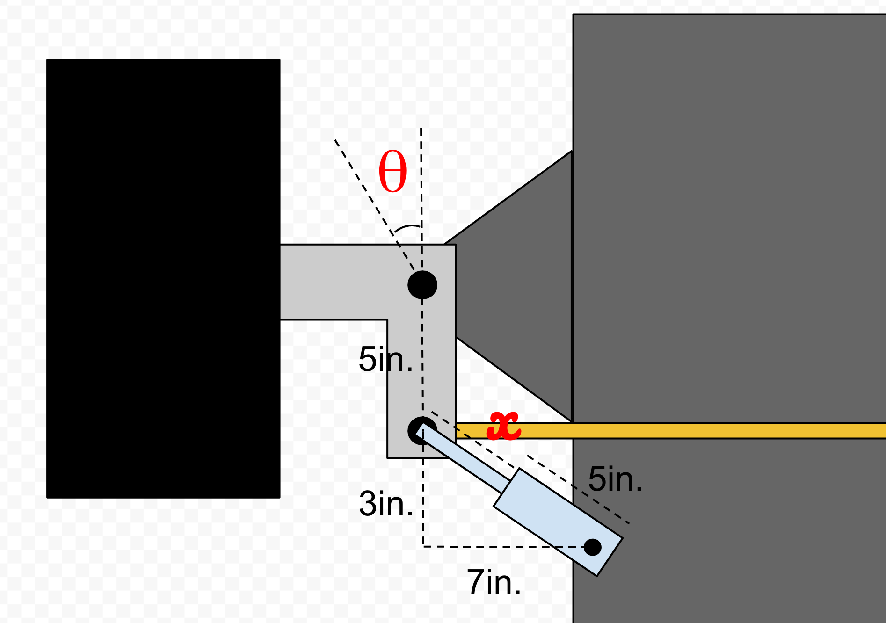
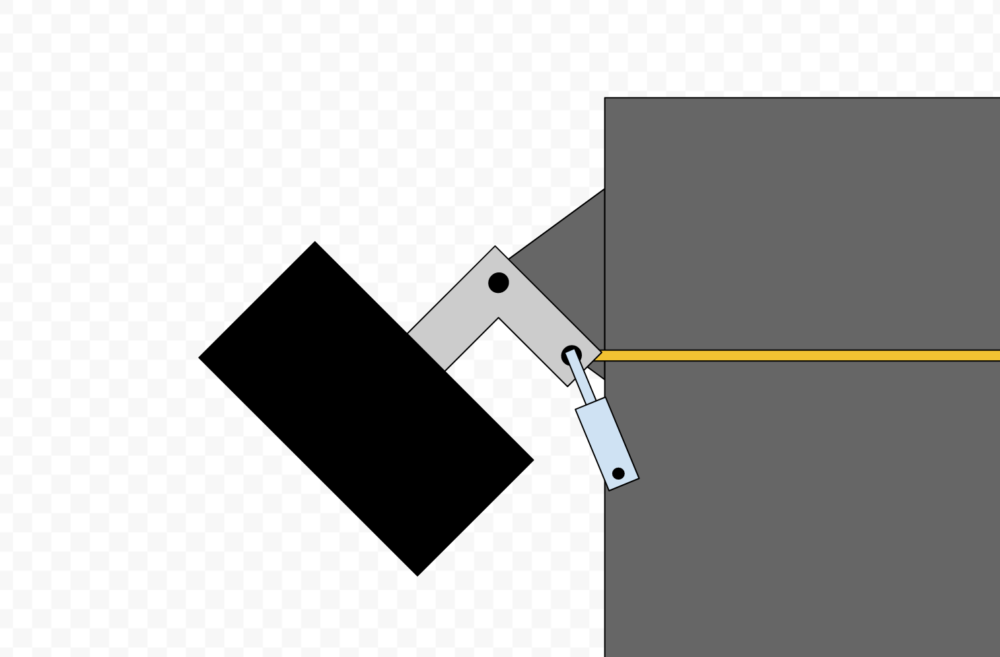
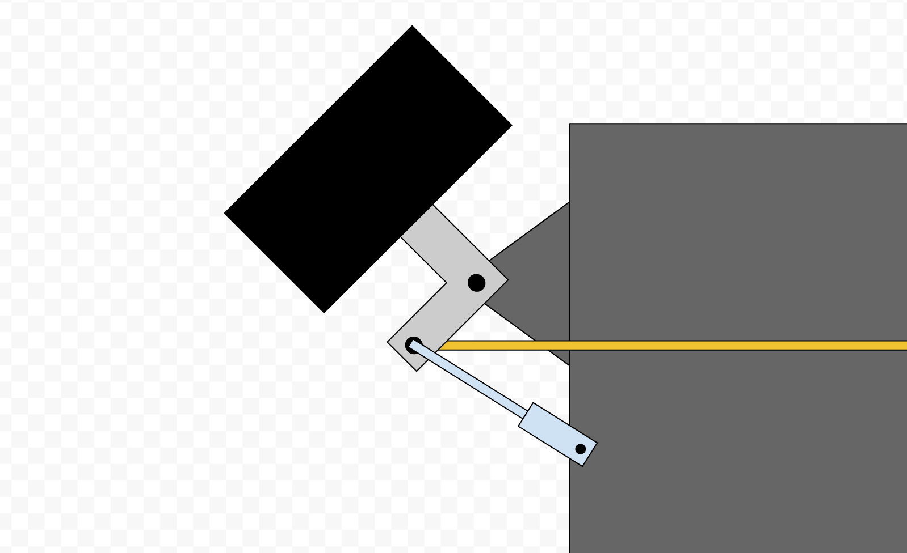

## General instructions

This test is made up of 3 challenges. The first two are designed to test your
basic knowledge of math, logic, statistics, and problem solving. The last
challenge is designed to test your ability to quickly integrate systems into a
working product.

For each challenge, read the instructions carefully and complete the required
work as written. In addition to the specific challenge prompt, also provide a
short written summary of your approach to the problem before you begin. Be sure
to include:

- How you intend to solve the problem
- Practical details about your implementation (e.g. what language you are using)

Be sure to include any written notes used in your solution and instructions for
each challenge on how to build and run the program for evaluation. _**If I
cannot run your code, I cannot evaluate you effectively.**_ Instructions for
macOS, Linux, or Windows acceptable.

Fork this repository and deliver your code and written materials by committing
to the repositories and emailing me the link to your repo (levi@rogoag.com). I
encourage you to use good git practices while working on these projects.

If you have additional questions, please email me at levi@rogoag.com with "WORK
TEST" somewhere in the title line.

Note: These challenges are for evaluation purposes and are not providing Rogo
any commercial value. Your answers belong to you.

## Challenge #1 (target time 30min)

A 4 wheeled vehicle has a linear sensor mounted to measure steering angle of
the front wheel (see diagram). Write a function in the language of your choice
to convert linear distance to steering angle.

The linear sensor is a collabsible piston. `x` is used to represent the length
in inches of the movable part of the sensor and is the independent variable.

`θ` represents the steering angle. The angle is 0 when the wheels are perfectly
straight and increases as the wheels turn to the left and decreases as the
wheels turn to the right. The value of `θ` should be reported in radians.

Identify any potential problems (any type mechanical or software) with this
setup and brainstorm possible solutions.

## Challenge #2 (target time 30min)

An phone application was used to record a boundary polygon around a region.
Write a function in the language of your choice using statistical methods to
smooth the data and remove outliers. Justify the implementation you choose.

The coordinates of the region are in the provided `region.json` file.

Bonus: Parse the boundary from the provided `region.kml` KML file and generate
a new KML file with the updated boundary.

## Challenge #3 (target time 4+ hr)

Build and deploy a task management app which meets the following requirements:

#### Basic requirements:

B1. The app must support adding, deleting, and marking tasks completed  
B2. The app must work on multiple devices simultaneously  
B3. The app must sync tasks between multiple devices  
B4. The app must maintain basic functionality (req B1) in the absence of a network connection  
B5. In the case of an offline usage scenario, the app must sync changes once a network connection is re-established.  

#### Architecture requirements:

A1. The app may be a web or mobile app  
A2. The app must be deployable to my device for evaluation (Android, iOS, Desktop all work)  
A3. The basic requirements must be demonstrable through a demo  

#### Other requirements:

O1. The app should be easy to use without training or explanation  
O2. The app should look nice to a user  

An AWS EC2 instance (Ubuntu Linux) may be provided on request for backend work.
Alternatively, it is perfectly acceptable to run the app backend locally on
your development machine, but be prepared to demonstrate live in an interview.

When completing this project, prioritize the requirements in the order listed
here -- get the basic requirements done first and then worry about deployment
and demonstrability. Remember, this is an evaluation and not a real project. It
is expected that the app will be rough around the edges. This challenge is
intended to test your ability to solve problems quickly and integrate systems
to bring something to life quickly. Any working code is better than nothing for
evaluation purposes.

In your pre-challenge summary, include a description of any additional features
you intend for your app to have.

After completing the app, provide a short summary describing:

- The state of the app
- What requirements you were unable to meet (if any)
- What features are actually working in the app

Do not go back and change your pre-challenge summary after completing the app.
